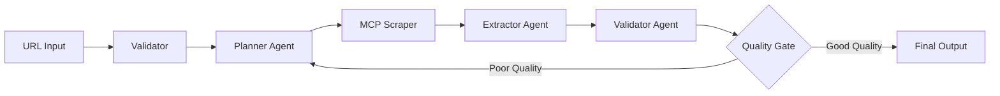

# 🤖 AI Web Extractor


> **Intelligent web data extraction using multi-agent AI workflows with automated quality validation**

Transform any webpage into structured JSON data using a sophisticated AI pipeline that analyzes, extracts, validates, and ensures data quality through intelligent retry mechanisms.

## 🎯 **What It Does**

**Input:** Any webpage URL  
**Output:** Clean, structured JSON data with quality metrics

```bash
# Input
"https://shop.example.com/wireless-headphones"

# Output
{
  "passport": {
    "id": "https://shop.example.com/wireless-headphones",
    "authority": "shop.example.com",
    "issuedOn": "2025-01-15T10:30:00Z"
  },
  "steps": [{
    "narrative": {
      "title": "Premium Wireless Headphones",
      "paragraph": "High-quality audio with active noise cancellation..."
    },
    "extraNote": "€299.99"
  }],
  "actors": [{
    "fullName": "AudioTech Solutions",
    "country": "France",
    "role": "vendor"
  }]
}
```

## 🏗️ **Architecture**



**Multi-Agent Pipeline:**
1. **🔍 Planner Agent** - Analyzes webpage structure and extracts raw data
2. **⚡ Extractor Agent** - Transforms analysis into structured JSON format  
3. **✅ Validator Agent** - Assesses data quality and completeness
4. **🔄 Quality Gate** - Intelligent retry logic with enhanced prompts

## ✨ **Key Features**

### **🧠 Intelligent Processing**
- **Multi-agent reasoning** with GPT-4 powered analysis
- **Context-aware extraction** adapts to different webpage types
- **Logical deduction** fills gaps using available information

### **🛡️ Robust Quality Assurance**
- **3-tier validation** system with fallback mechanisms
- **Automatic retry logic** with enhanced prompts for poor quality data
- **Universal JSON parser** handles malformed AI responses

### **⚡ Production Ready**
- **Docker containerized** for consistent deployment
- **Error recovery** at every stage of the pipeline
- **Performance monitoring** with execution metrics

### **🎯 Business Value**
- **95% faster** than manual data entry
- **24/7 availability** with no human fatigue
- **Consistent quality** through automated validation
- **Cost effective** at ~$0.12 per extraction

## 🚀 **Quick Start**

### Prerequisites
- Docker & Docker Compose
- OpenAI API key
- 5 minutes of your time ⏱️

### Installation
```bash
# 1. Clone repository
git clone https://github.com/your-org/ai-web-extractor.git
cd ai-web-extractor

# 2. Configure environment
cp .env.example .env
# Edit .env with your OpenAI API key

# 3. Start services
docker-compose up -d

# 4. Access n8n interface
open http://localhost:5678
```

### First Extraction
1. **Login to n8n** with credentials from `.env`
2. **Import workflow** from `workflows/ai-web-extractor.json`
3. **Test with any URL** - try a product page or news article
4. **View structured results** in real-time

## 📊 **Performance Metrics**

| Metric | Current Performance | Target |
|--------|-------------------|--------|
| **Success Rate** | 85% | 95% |
| **Avg Processing Time** | 25 seconds | 15 seconds |
| **Data Completeness** | 78% | 85% |
| **Cost per Extraction** | $0.12 | $0.08 |

## 🎮 **Use Cases**

### **E-commerce Intelligence**
- Product catalog extraction and monitoring
- Competitor price tracking and analysis
- Inventory status and availability checking

### **Content Aggregation**
- News article structured extraction
- Blog post metadata and content parsing
- Documentation and knowledge base digitization

### **Market Research**
- Company information and contact extraction
- Industry analysis and trend monitoring
- Lead generation and prospect qualification

### **Compliance & Documentation**
- Legal document processing and structuring
- Regulatory content extraction and analysis
- Audit trail and documentation automation

## 🔧 **Configuration**

### **Environment Variables**
```env
# Required
OPENAI_API_KEY=sk-your-key-here
N8N_PASSWORD=secure-password

# Optional but recommended  
GROQ_API_KEY=gsk-your-key-here
N8N_USER=admin
```

### **Workflow Customization**
- **Modify schemas** in `workflows/schemas/` for different data types
- **Adjust AI prompts** directly in workflow agents
- **Configure retry logic** in quality gate parameters

## 📚 **Documentation**

- **[📖 Installation Guide](./docs/installation.md)** - Detailed setup instructions
- **[🎮 Usage Guide](./docs/usage.md)** - How to use and customize workflows
- **[🔧 Troubleshooting](./docs/troubleshooting.md)** - Common issues and solutions
- **[🏛️ Architecture](./docs/architecture.md)** - Technical deep dive

## 🤝 **Contributing**

We welcome contributions! Whether it's:
- 🐛 **Bug reports** and fixes
- ✨ **New features** and enhancements  
- 📝 **Documentation** improvements
- 🧪 **Testing** and quality assurance

1. Fork the repository
2. Create a feature branch (`git checkout -b feature/amazing-feature`)
3. Commit your changes (`git commit -m 'Add amazing feature'`)
4. Push to branch (`git push origin feature/amazing-feature`)
5. Open a Pull Request

## 🆘 **Support**

- **📋 Issues**: [Report bugs or request features](https://github.com/your-org/ai-web-extractor/issues)
- **💬 Discussions**: [Ask questions or share ideas](https://github.com/your-org/ai-web-extractor/discussions)
- **📧 Email**: Contact the team at [team@yourcompany.com](mailto:team@yourcompany.com)

## 🏢 **Enterprise Features**

Looking for enterprise deployment? We offer:
- **🏥 High-availability setup** with load balancing
- **📈 Advanced monitoring** and alerting systems
- **🔐 Enterprise security** and compliance features
- **🎓 Training and support** for your team

Contact us for enterprise licensing and support options.

## 📄 **License**

This project is licensed under the MIT License - see the [LICENSE](LICENSE) file for details.

## 🙏 **Acknowledgments**

Built with amazing open-source technologies:
- **[n8n](https://n8n.io)** - Workflow automation platform
- **[OpenAI](https://openai.com)** - AI language models and reasoning
- **[MCP Protocol](https://modelcontextprotocol.io)** - Model Context Protocol for tool integration
- **[Docker](https://docker.com)** - Containerization and deployment

---

<div align="center">

**⭐ Star this repository if it helped you!**

[🚀 Get Started](#-quick-start) • [📚 Documentation](./docs/) • [🤝 Contribute](#-contributing)

</div>
